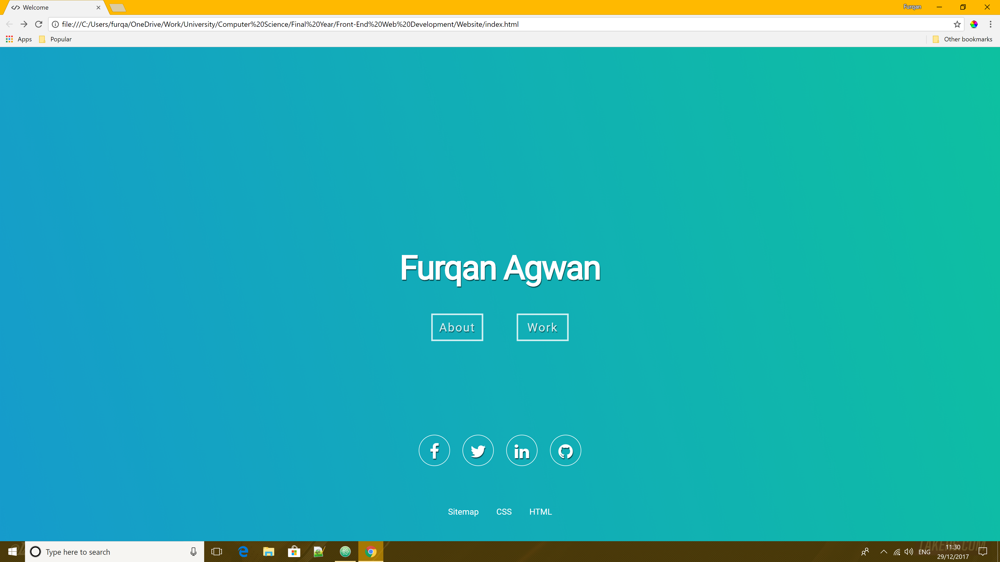
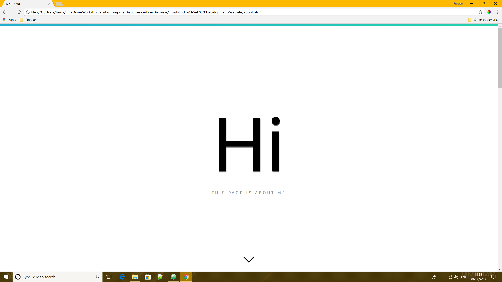
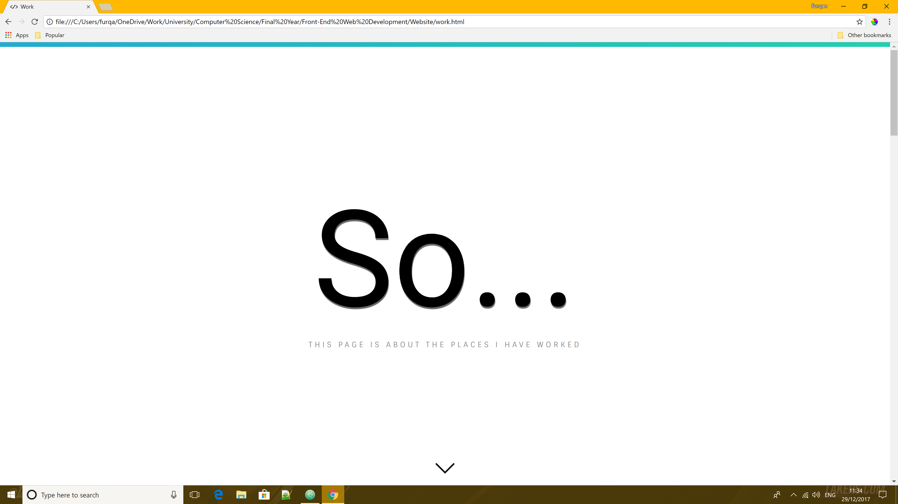
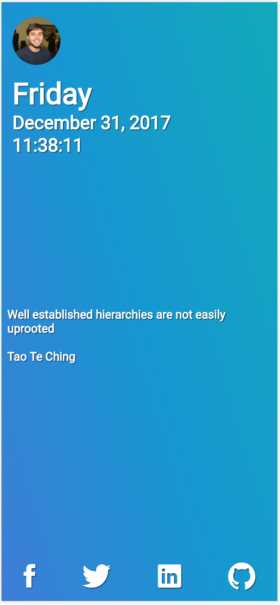
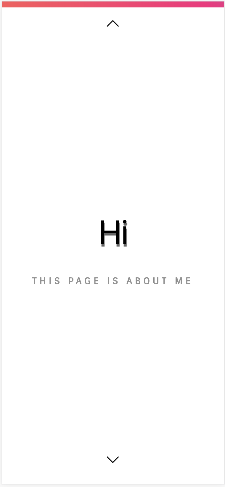
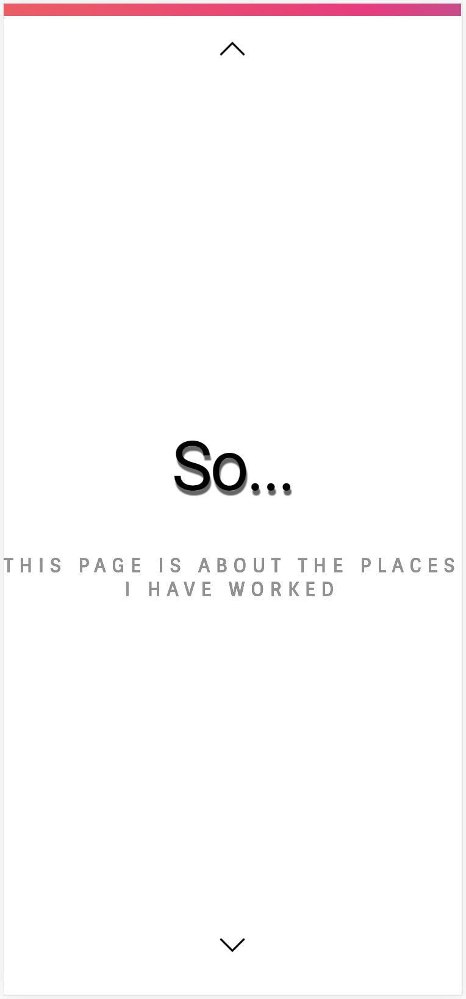

# My Website
Welcome to my Website. The website acts as a CV/Resume for myself and was designed as part of one of my University Assignments.
This website will be updated and maintain by self as soon as new information about me is released. Information such as current job or projects I am currently working on or contributing to, further more new technologies I have learned will be updated on my website. Design thought will change long after the assessment has finished and been marked. I will rethink on a new design approach of all my webpages, but for the assessment this is what I have produce.

This Website is also optimized well for mobile users. The aim was to keep the website simple as it is not a big project, or requires any server-side interaction. The information below shows all the API's, references and technologies used to create this website. Information regarding challenges and Website thought and design process.

I have spent many hours on this website as can be seen by my entire commit history. I still fell I can improve further however that requires time to learn more about designing and providing functionality to a website.
I have a solid fundamental understanding of JavaScript, going forward the use of jQuery should be the preferred framework when designing websites, this is because its lightweight and you can archive the same functionality with less code resulting in faster loading times for pages.
## Assessment
Links to this GitHub pages website and the project repository are below. A txt file has also be added to the project file structure which includes student information such as p-number and name (Assessment Purposes). The txt file is the same one I submitted on turnitin.

[Website](https://fugster101.github.io/)

[Repository](https://github.com/fugster101/fugster101.github.io)

A link to all my other projects is displayed below

[Account](https://github.com/fugster101?tab=repositories)

## Hand-drawn Tree Structure
The following sketch shows the tree structure of this website. This outlines the files falling under the root node(webpage). Since there are only three internal webpages that make up this website the tree diagram is not complicated.


## Initial Design
The following sketches reflect the initial design of my website, however they were subject to change. As this has used a mobile first approach I have focused more on the mobile design rather than the desktop design. I have also mentioned the file names that will be used in the project. I have named all the files in this project to something appropriate and meaningful.

### Mobile Design
**Note: This is not the final design of the mobile website just a UI mock. If images are not viewable here please look in the GitHubimages folder for direct access to the image files**


### Desktop Design
**Note: This is not the final design of the mobile website just a UI mock. If images are not viewable here please look in the GitHubimages folder for direct access to the image files**


Styles used in the mobile version would only need a stylesheet among them. This was the initial plan.

## Final Design of Website (Screenshots)

As you can see form the initial sketches of the website my website has changed quite a bit. I rethought about the homepage and was inspired of minimalistic design as advised by Google.
While a website can be minimalistic it can contain a lot of code and functionality. The mobile version of the index page was app based inspired and the desktop version is much more simplistic in mind.
Consistency was also important therefore you can see both the mobile version of the about and work follow the same idea of having a scrolling card based UI. The desktop version of these sites follow a speech
based UI as it brought a more personal touch to my website.

I have multiple stylesheets for each pages and styles defined for the desktop wrapper and mobile wrapper. The animations CSS styles is used throughout the website therefore I am pulling that stylesheet on every page. The file structure of the project
is set out to be easy to understanding and read. It was easy for me to understand and use as it was just a matter of picking the stylesheet for the corresponding pages instead and working from there. Below are the final screen shots of the website.

### Desktop Version







### Mobile Version







# Responsive Web Design
As part of my assessment responsive design was an essential marking criteria for the website. The website was design mobile first in mind making transition to the desktop version of website was smooth and easy. Responsive design also includes responsive images, multimedia and responsive text making sure they fit any browser.
## Mobile First
All CSS for mobile is written first with no media query rule defines making the styles default for the given webpage. Media queries have been defined for screen sizes with a minimum width of 768px or more. This allows me to write further CSS for specific screen sizes in the future. In total there is only one breakpoint defined although more can be implemented for example:
* *iPhone Specific*
* *iPad Specific*
* *4K/5K Monitors and iMac's*
Upon resizing the users windows the website will automatically kick in the different CSS stylesheets.

At the start of this project I had a lack of knowledge regarding responsive design and while CSS frameworks such as bootstrap that take care of responsive I felt writing specific CSS code for different screen sizes is much more of a challenge. Intensive research regarding web design patterns was done, where most of the information was provided by Pete LePage (Google Web Fundamentals Technical Writer). The article explains the use of CSS style rules to achieve a certain website design pattern. I have used a fluid design pattern as it still remains to the most popular design pattern to style content on a webpage. A link to the article is provided in the reference section.
# SiteMap
The following section shows the XML markup of my website. The XML is particular useful for Search engine optimization for Google and Bing. A xml file of the sitemap is provided in the sitemap folder which is also indented and formatted correctly. A HTML version of the sitemap is located on my live website, of which the generator is provided by XML-Sitemap.com a link is in the reference section below.
## XML Version
```xml
<?xml version="1.0" encoding="UTF-8"?>
<urlset
  xmlns="http://www.sitemaps.org/schemas/sitemap/0.9"
  xmlns:xsi="http://www.w3.org/2001/XMLSchema-instance"
  xsi:schemaLocation="http://www.sitemaps.org/schemas/sitemap/0.9
  http://www.sitemaps.org/schemas/sitemap/0.9/sitemap.xsd">
  <url>
    <loc>https://fugster101.github.io/</loc>
    <lastmod>2017-12-29T12:06:53+00:00</lastmod>
    <priority>1.00</priority>
  </url>
  <url>
    <loc>https://fugster101.github.io/about.html</loc>
    <lastmod>2017-12-29T12:06:53+00:00</lastmod>
    <priority>0.80</priority>
  </url>
  <url>
    <loc>https://fugster101.github.io/work.html</loc>
    <lastmod>2017-12-29T12:06:53+00:00</lastmod>
    <priority>0.80</priority>
  </url>
  <url>
    <loc>https://fugster101.github.io/documents/furqanagwan.docx</loc>
    <lastmod>2017-12-29T12:06:53+00:00</lastmod>
    <priority>0.64</priority>
  </url>
</urlset>
```
# Cross-Compatibility
Due to the nature of the Assessment cross-Compatibility was not part of the making criteria and was told not to worry about it. Although future implementations of the website will accommodate for other browsers except for internet explorer. This is just a matter of adding web kit prefixes on animation and styles.

I have been a big fan of chromes inspect tool in the development of this website due to chrome support of toggling certain CSS styles and animations.
# User Testing
I have personally tested the live website on my iPhone X and support has been great all JavaScript functionality is working and all text and images scale to fit the device width. All API request also work great although there some delay in it appearing which is down to the response time received from the server. All google fonts showed correctly and with the right styles.

I also got one of my friends to test my website on their phone. My friends phone was and Android (Samsun Galaxy S7 Edge) and while all the functionality worked due to the curved edge screen, the  back "to the top" button look out of position, he also mentioned that some google fonts were not showing. Since this worked on my iPhone this may be a feature that Samsung's OS has disable custom font imports.

# Additional Notes
## For the Marker
Please make sure the browser is chrome with the latest update for compatibility reason chrome works best and this website was designed and tested using chrome and its inspector feature to point out any errors and toggle element position's and their respective styles.

I have tried to remove redundant code and resources to keep webpage request time from GitHub servers as fast as possible. I have also resized all images to 1080p and nothing more as I felt that would have been an optimal image size and is not too resources intensive. In order to make the request faster a minified file for all my CSS and JavaScript can be provided, or using a beautifier.

For the most part of working on this website most of the commits have been pushed to the master branch and so live website was also update, but more recently I have created a new branch to push commits to. The new branch "websitetestbranch" contains all the same code and markdown but acts as a testing project and so when I feel I have made major changes. If you can see my commits history I have now merged the testing branch and master branch back together but have still kept the testing branch still active. This was done for experimenting with technologies features and such.

All multimedia and images used in this website were provided by Unsplash and all authors have released their images under the Creative Commons (CC0) license. Future improvements to this site will use Unspalsh API and/or use the Unsplash embed website tool, that can randomly generate new images upon every request. I have now obtained a Unsplash API license by which going forward I am hoping to make use of it.

The design thought and process regarding this website was simple. The idea was to create a simple CV website that showcased the normal things you would expect to see on a regular CV. This includes interest and hobbies, technologies I am interested in etc. The website does contain a downloadable CV that user can download if they wish to , however the document is password protected and so editing and copying on the document is not possible and is only available on the mobile version of the work.html page.

I have designed the markup in way for the mobile version and desktop version of the site to be different
are similar I could have just made the desktop version of this site a blown up version of the mobile site, but I did not want to that as it did not look aesthetically good, however I have kept the styles and overall information organization of the site the same.

The script technologies used to create this website are vanilla/pure JavaScript and External JavaScript libraries. I have used XML WEB API and the new Fetch API Request to get server stored JSON data.
Using these technologies has provided me a sound understanding of how to use JavaScript 3rd party libraries and the native JavaScript language to manipulation of the DOM. I have also used tippy.js for some tool tip features on mouse enter events, however the options regarding were coded by myself.
Any 3rd party libraries are hosted on a CDN this includes tippy.js and fontawsome. Sometime a rawGit CDN needs to be hosted for these repositories if script fails to load resource from origin in the chrome inspector. And the only third party code being used the library tippy for the tippy function initializer, however the options for a tippy instance I needed to use the API documentation provided by the library. Integration with google maps and twitter is being used therefore please expect some delay on request and response from their respective servers.

The JSON folder contained valid JSON code that I was going to use in my website. I was going to reverse request to my repository but GitHub have some tight security features enabled that blocked my request. So I used the data as a object instead on my mobile version of my about page. This demonstrates the ways of using JavaScript objects and handling JSON data.

**Note: I have left some resource that are not in use in my repo for future use.**

Feel free to download any files located on the repository if you wish to keep them locally.

## Validation and Verification

In my website I have included direct links to the validation tools for checking the pages of my website when it come to marking.
I have personally checked weather my website passes validation both in HTML and CSS.

## *References*

(2017) JavaScript Tutorial. [Online] Available from: [https://www.sololearn.com/Course/JavaScript/] [Accessed 23/10/2017]

(2017) Stack Overflow - Where Developers Learn, Share, & Build Careers. [Online] Available from: [https://stackoverflow.com/] [Accessed 28/10/2017]

(2017) W3Schools Online Web Tutorials. [Online] Available from: [https://www.w3schools.com/] [Accessed 1/11/2017]

(2017) CSS-Tricks. [Online] Available from: [https://css-tricks.com/] [Accessed 1/11/2017]

(2017) Create your Google Sitemap Online - XML Sitemaps Generator. [Online] Available from: [https://www.xml-sitemaps.com/] [Accessed 2/11/2017]

Walsh, D. (2017). David Walsh Blog. [Online] David Walsh Blog. Available from: [https://davidwalsh.name/] [Accessed 4//11/2017]

LePage, P. (2017). Responsive Web Design Basics  |  Web Fundamentals  |  Google Developers. [Online] Google Developers. Available from: [https://developers.google.com/web/fundamentals/design-and-ux/responsive/] [Accessed 10/11/2017]

LePage, P. (2017). Responsive Web Design Patterns  |  Web Fundamentals  |  Google Developers. [Online] Google Developers. Available from: [https://developers.google.com/web/fundamentals/design-and-ux/responsive/patterns] [Accessed 13/11/2017]

Gandy, D. (2017). Font Awesome, the iconic font and CSS toolkit. [Online] Fontawesome.io. Available from: [http://fontawesome.io/] [Accessed 15/11/2017]

(2017). Ionicons: The premium icon font for Ionic Framework. [Online] Available from: [http://ionicons.com/] [Accessed 15/11/2017]

(2017) Tippy.js - Vanilla JS Tooltip Library. [Online] Available from: [https://atomiks.github.io/tippyjs/] [Accessed 29/12/2017]
